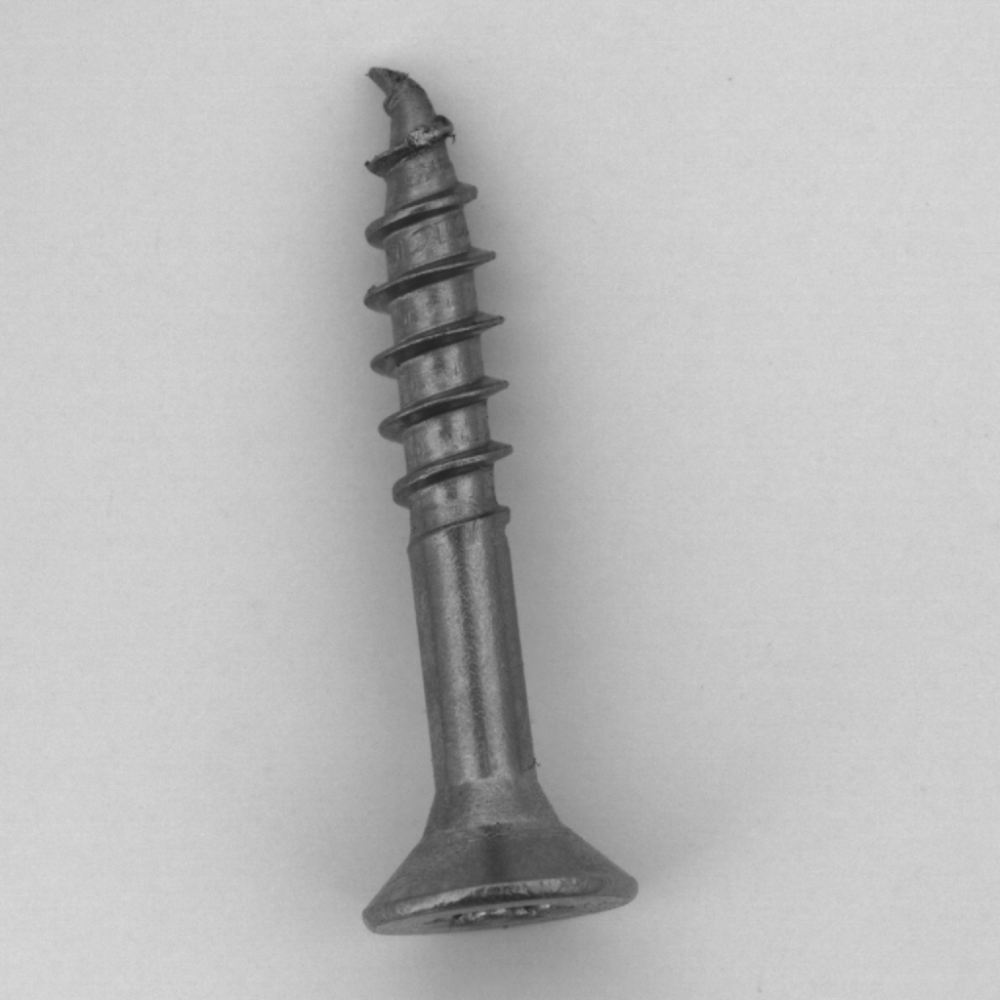
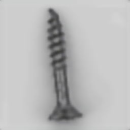
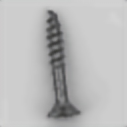
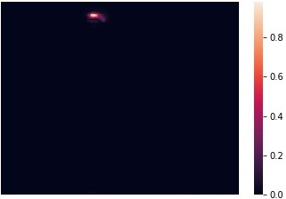
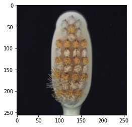
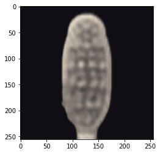
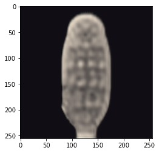
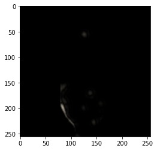

# Anomaly Detection from Normal Images

Inspired By - Image Anomaly Detection Using Normal Data Only by
Latent Space Resampling

link : https://doi.org/10.3390/app10238660

_______________________________________________________________

_______________________________________________________________

# Example 1 

| Anomoulous Image | Direct Recon | Resampled Recon | Anomaly Score Map | 
| --- | --- | --- | --- |
|  |  |  |  |

_________________________________________________________________

# Example 2

| Anomoulous Image | Direct recon | Resampled recon | Anomaly score map | 
| --- | --- | --- | --- |
|  |  |  |  |

______________________________________________________________________

